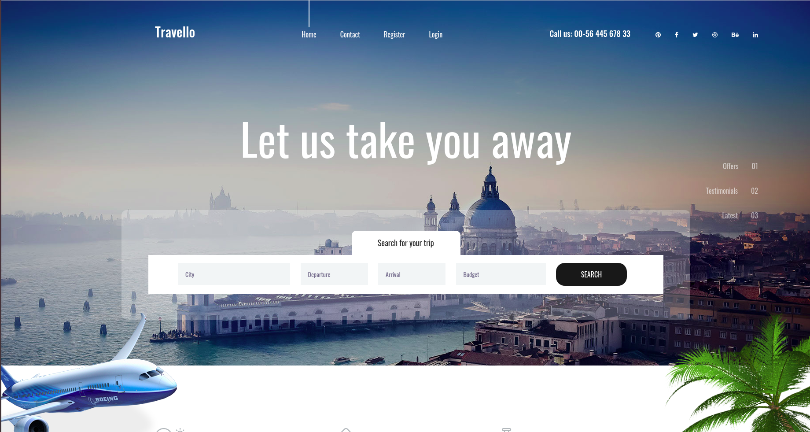
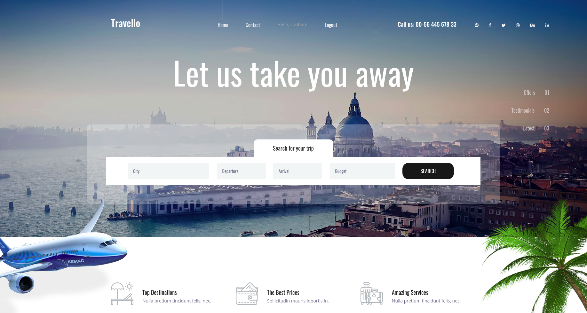
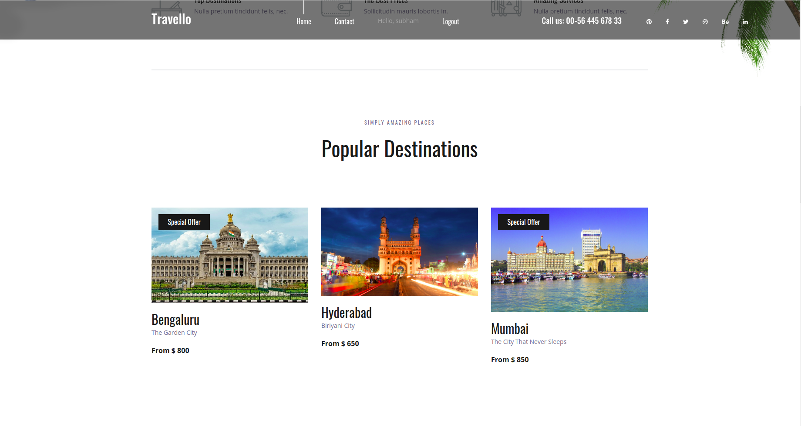

# Travello-App
Travello App is created with Django. Basically a new user can navigate to the home page and go through different locations (which are dynamic in nature and fetching from the DB) &amp; can see the pricing. If the use wants then he can register there and do login with his Credentials.

*Folder details----

my_django_project:Base Project

travello:Travello Application's Home Page

accounts:application to Register,Login & Logout

static:static files

media:Pictures of diff location which is present in DB

*A new user will get this below page, where he can able to register him-self and login.

*If the user successfully register himself then he will redirect to the login page, where he can do login. After login, he will get the UI like this....."Hey UserName" & "Logout" option

*Different location's data--
Contents are fetching from the DB (having it's image, name, special offer details, desc of place and pricing)and it is dynamic.

